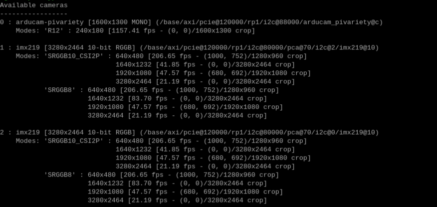

# Depth Camera Usage Guide

In this section, you will learn how to create a depth map, including the software and hardware setup, as well as how to build a box to house all the components.

## Prerequisites

To complete this project, you will need the following components: (include links or sources for these)
- Raspberry Pi 5
- Time-of-Flight (ToF) sensor
- Binocular system composed of 2 IMX219 cameras
- Module V2.2 (camera multiplexer)
- 5V, 5A power supply
- Keyboard and mouse
- Screen with microHDMI cable (choose the type of cable based on your screen)

For building the box, you will need a 3D printer and PLA filament for printing.

You will also need a soldering iron, solder, and wires.

## Installation Guide

To set up a depth camera, first ensure you have all the components listed in the previous section.

The configuration for each component is provided in the respective component's folder.

Follow the installation in this order:

1. Setup the Raspberry Pi
2. Setup the ToF
3. Setup the binocular system

Make sure to match the configuration lines with those in the provided example.

Once these steps are completed, you can proceed to assemble the box and install your system.

## Box Assembly Guide

In this section, we will explain how to assemble the box (final image of the box). You will find the different parts to print in the 3D print folder. Note that supports are not included; you will need to add them during printing.

It is recommended to first follow the previous instructions and ensure that all systems are working before assembling the box. A component might be defective.

1. Connect the CSI cables to the Raspberry Pi.
2. Place the Raspberry Pi in its position. To insert it, angle it slightly due to the USB ports. You will need to apply a bit of force. The USB ports should protrude. You can then check the HDMI and USB-C ports.
3. Connect the CSI cables to the V2.2 module.
4. The V2.2 module comes with 2 standoffs. Insert the standoffs into the holes of the Raspberry Pi.
5. Place the module on the Raspberry Pi and secure it with screws onto the standoffs.
6. Insert the cameras into their designated slots and secure them with screws and bolts.
7. On the front panel: secure the ToF with screws and bolts.
8. Connect all cameras and the ToF to the Raspberry Pi.
9. Attach the front panel of the box: first secure the bottom holes, then the top ones.
10. Connect the microHDMI cable and the power supply.
11. Close the cover and connect the keyboard and mouse.
12. Power on the Raspberry Pi and check the camera connections by opening a terminal.

```bash
libcamera-still --list
```
Here is what you should see:


If you encounter any issues, repeat the steps. A cable may have become disconnected or may be connected incorrectly.

## Using the Depth Camera
After compiling the code, you can interact with it.

Press the following keyboard keys after clicking on the window you want to interact with:
- `q` to quit
- `s` to save images of the depth map
- `t` to analyze visible objects and determine their distance

To completely stop the code, press `CTRL+C`. However, you will need to restart the Raspberry Pi if you want to run the code again.


## Compilation

To compile the code, use the following line:

```bash
python main.py
```

## Code

### Class `DepthMapProcessor`
This class handles the processing of depth and disparity maps, including segmentation, calculation of average amplitudes, and contour drawing.

#### `__init__`
Initializes the `DepthMapProcessor` class with the provided parameters.

#### `apply_morphological_operations`
Applies morphological operations (dilation and erosion) to the specified image.

#### `calculate_mean_amplitude`
Calculates the mean amplitude for each specified contour.

#### `find_and_draw_contours`
Finds and draws contours in the processed image.

#### `process_contour`
Processes contours by applying morphological operations, finding and drawing contours, and calculating mean amplitudes for the detected contours.

#### `process_disparity_image`
Processes the disparity image by segmenting it according to the defined thresholds, then applying contour processing on each segment.

### Class `DualCameraCapture`
This class manages image capture with two cameras, including validating and displaying captured images.

#### `__init__`
Initializes parameters for image capture with two cameras.

#### `capture_and_save_image`
Captures and saves an image from the specified camera.

#### `display_images`
Displays captured images from specified files.

#### `validate_images`
Validates whether the captured images are acceptable.

#### `capture_images`
Captures a specified number of image pairs and saves them in the specified folder.

### Class `StereoVision`
This class handles stereo vision, including image capture, calculation of disparity and depth maps, and processing of depth maps.

#### `__init__`
Initializes parameters for stereo vision.

#### `stereo_taking`
Captures and rectifies stereo images.

#### `save_images`
Saves the images and the normalized disparity map.

#### `depth_map_calcul`
Calculates the disparity map from the rectified images.

#### `depth_calcul`
Calculates the depth for each pixel from the disparity map.

#### `process_stereo`
Processes the depth map using `DepthMapProcessor`.

#### `capture_and_compute`
Captures images, calculates the disparity and depth maps, and then queues the results.

#### `depth_map_display`
Displays the disparity map and depth from the queued results.

#### `process_and_display`
Creates processes for capturing and computing images, as well as displaying results.


### Functions

#### `folder_create`

Checks if a folder exists, otherwise it creates one.

#### `file_create`

Creates a file of the specified type in a given folder (optional).

#### `show_image`

Displays an image with a specified colormap.

#### `calibrate_cameras`

Calibrates cameras using a calibration process based on photos of a checkerboard.

#### `run_tof_camera`

Runs the ToF camera continuously and updates a queue with depth data.

#### `run_stereo_vision`

Performs stereo vision to obtain disparity and depth results.

#### `terminate_processes`

Terminates the specified processes.

#### `kill_zombie_processes`

Terminates zombie processes detected on the system.

#### `clean_temp_dirs`

Cleans up specified temporary directories.

#### `cleanup`

Performs system cleanup operations and frees up memory.


