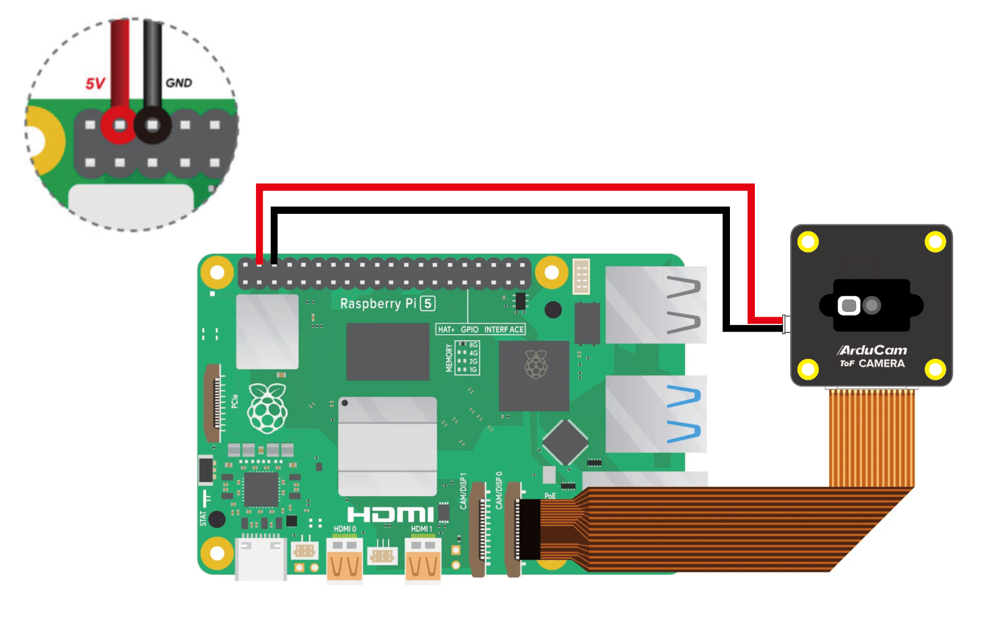
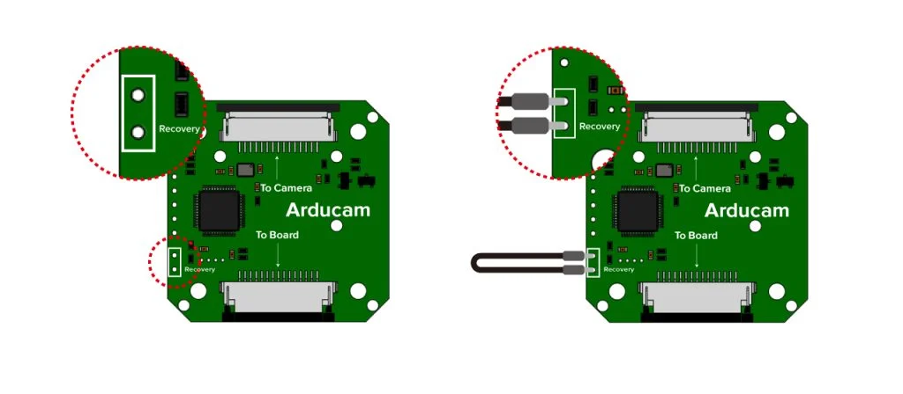
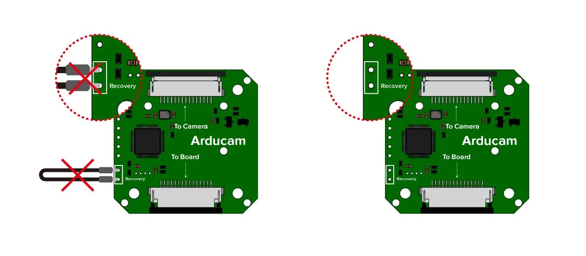
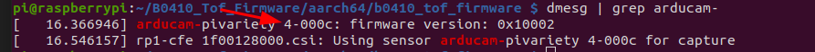
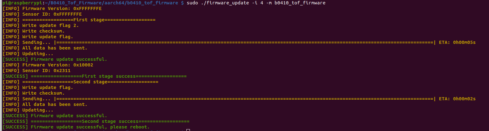

# Time-of-Flight (ToF) Sensor Configuration

This document provides instructions for configuring a time-of-flight (ToF) sensor on your Raspberry Pi 5. Initially, we will see how to initialize the sensor on the Raspberry Pi. Once these steps are completed, you will not need to redo them. You can then simply compile the code.

## Required Hardware

Before you start, make sure you have the following items:

- Compatible Raspberry Pi
- Time-of-Flight (ToF) sensor
- GPIO cable (if necessary)
- Male-to-Male Dupont cable

## Configuration Steps

### Connecting to the Raspberry Pi 5

Connect the CSI cable to the cam 0 port (the one closest to the Ethernet connector), and connect the 5V and GND to the pins, as shown in the following schematic:



### Step 1. Connect the Arducam ToF Camera to the Raspberry Pi

Note that the Raspberry Pi should remain turned off during the connection, and the power cable should be removed.

### Step 2. Keep Your Raspberry Pi Powered Off

Please keep your Raspberry Pi powered off and activate the recovery on the Arducam ToF camera board using the Dupont line (a male-to-male cable may suffice if you do not have a Dupont line):



### Step 3. Turn On Your Raspberry Pi

Please deactivate the recovery after turning on the RPi:



Simply remove the Dupont line.

## Download the Firmware Update Tool

```bash
B0410_Tof_firmware.tar.gz
```

## Install Dependencies

```bash
sudo apt update -y && sudo apt install -y libtinfo5
```

## Unzip the Update Tool

### Tip

You can check whether your system is 32-bit or 64-bit by using the command `dpkg --print-architecture`. Then, you can execute the following commands based on the version of your operating system:

```bash
tar xzvf B0410_Tof_Firmware.tar.gz
# for a 64 bits system
cd B0410_Tof_Firmware/aarch64/

# for a 32 bits system
cd B0410_Tof_Firmware/armv7l/
```

## Update the Firmware

### Check the I2C Bus

You can then check the I2C connection:

```bash
dmesg | grep arducam
```
You should see the code x-000c.

By default, the code is 4-000c. However, this code may change.



### Update the I2C Bus

Next, you need to update the firmware. To do this, enter the following line in your terminal:
Make sure to replace `x` with the I2C bus port number.


```bash
sudo ./firmware_update -i x -m b0410_tof_firmware
```

Check that the address is `0xFFFFFFFE` on the first lines.



If not, repeat the steps to connect the sensor. You will need to redo the last 2 steps.

### Reboot

Next, restart your system.

``` bash
sudo reboot
```

## Using the Camera

To use the camera, follow these steps:

### Step 1. Download the Git Repository

``` bash
git clone https://github.com/ArduCAM/Arducam_tof_camera.git
```
### Step 2. Enter in the folder

``` bash
cd Arducam_tof_camera
```
### Step 3. Install the dependencies

``` bash
./Install_dependencies.sh
```
Enter 'y' for reboot the Raspberry Pi.

You can verify thzt the next line is in your config.txt file.

``` bash
dtoverlay = arducam-pivariety,cam0
```

### Step 4. Compile

Compile the code to check its functionality and install any missing components.

``` bash
./compile.sh
```
The live camera feed should then open. Use `Ctrl + C` to stop the code.

### Step 5. Python Configuration

Enter this line in the terminal:
``` bash
./Install_dependencies_python.sh
```

It may be necessary from time to time to redo steps 3 and 4. Indeed, some libraries may need to be updated, or the connection with the ToF sensor might be lost. You do not need to redo step 5.

# The Code

The goal of this code is to operate the ToF sensor through a process. To make it work, please refer to `main.py`.

In the following sections of this guide, we will review the source file `tof_sensor.py`.

## Code Description

### Description

The `TofCamera` class manages image capture from a Time-of-Flight (ToF) camera, processes depth and amplitude data, and displays the results.

### Methods

#### `__init__(self, max_distance: float)`

Initializes the ToF camera with the maximum measurable distance.

#### `process_frame(self) -> np.ndarray`

Processes the captured frame and returns the resulting image.

#### `capture_image(self)`

Saves the resulting image under the name `tof{n}.png`.

#### `process_tof(self)`

Processes the depth map to extract contours.

#### `continuous_display(self)`

Continuously captures and displays images from the ToF camera.

#### `cleanup(self)`

Stops and closes the camera, and destroys all OpenCV windows.

#### `get_depth_buf(self) -> np.ndarray`

Returns the current depth buffer.

#### `get_depth_normalized(self) -> np.ndarray`

Returns the normalized depth map.


