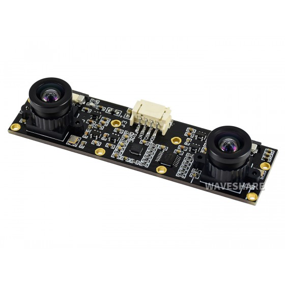
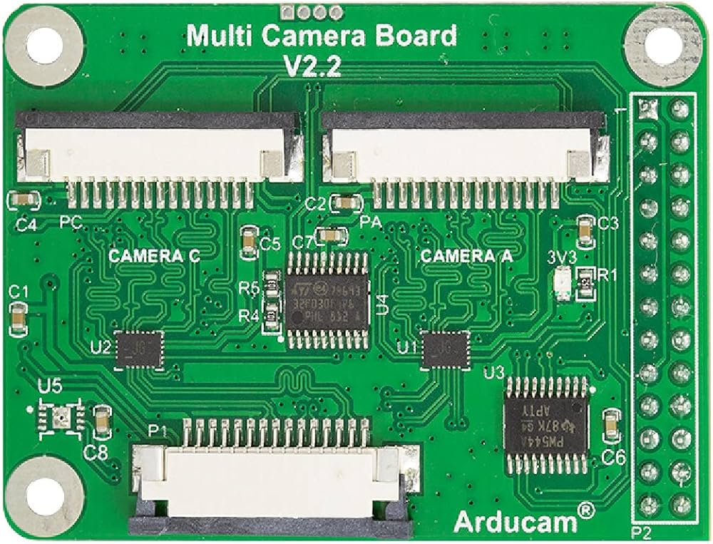

# Camera Configuration

In this section, we will see how to configure the 2 IMX219 cameras (or other cameras) on an Arducam camera multiplexer (module V2.2).

<div style="display: flex; justify-content: space-between;">
    
    
</div>

First, make sure you have the appropriate camera cables for use with the V2.2 module.

To get the cameras to work on this module, they must be of the same model.

In a terminal, open the configuration file:
```bash
sudo nano /boot/firmware/config.txt
```

In the configuration file, you will need to add the following lines:
```ini
dtoverlay=arducam-pivariety,cam1
dtoverlay=camera-mux-4port,cam0-imx219,cam2-imx219
```
You will then need to associate each port with its number. Here is the letter-to-number correspondence:
- cam0: A
- cam1: B
- cam2: C
- cam3: D

# Stereo Camera Calibration

In this section, we will see how to calibrate the cameras so they can be used. This calibration will allow us to know the intrinsic and extrinsic parameters of our cameras.

The principle of stereo vision is to have a matrix on the right and left for each camera. Each element of our cameras is stored in dictionaries.

If you want to understand the principle of a binocular system, please refer to the document mathematics_model.pdf. It outlines the mathematical modeling.

To save your calibration, the data is automatically recorded in the 'data' folder. Reuse is also automatic. You will not need to modify the code.

## Calibration Process
To calibrate the cameras, you need a chessboard. You can print the provided file. However, you must ensure it is rigid to prevent calculation errors due to camera distortion.

When you indicate you want to calibrate the cameras by entering 'y', you will have the option to specify the number of rows and columns on the chessboard, as well as the number of images you want to take.

Take different positions with the chessboard. However, make sure it is entirely within the images and close enough to the cameras for the best calibration quality. You can validate or invalidate the taken images if they do not meet your expectations.

## Measurement Process

Images are taken automatically, with delays. However, you can set delays by modifying the class at the time of its declaration in stere_vision.py.

A window will then open to view the map. You can modify the depth camera filter values if necessary, if the result is not satisfactory.

# The Code

## Code Description
In this section, we will see the different classes and functions that allow calculating the depth map, calibrating, and capturing images with the cameras.

## StereoCalibration

### Description
Manages the parameters and processes of stereoscopic calibration for two cameras.

### Methods

#### `__str__(self)`
Returns a string representation of the class attributes.

#### `__init__(self)`
Initializes the calibration parameters for stereo cameras.

#### `save_data(self)`
Saves the calibration parameters in `.npy` and `.csv` files.

#### `rectify(self, frames: list) -> list`
Rectifies the stereoscopic images using the undistortion and rectification maps.

#### `load_data(self, directory: str)`
Loads the calibration parameters from `.npy` files in a specified directory.

## Calibrator

### Description
Manages the calibration process for a pair of stereo cameras.

### Methods

#### `__init__(self, row: int, column: int, square_size: float, image_size: tuple)`
Initializes the parameters for camera calibration.

#### `corner_detect(self, image_pair: tuple)`
Detects the corners of the calibration board in a pair of images.

#### `calibrate_camera(self) -> StereoCalibration`
Calibrates the two cameras and determines their related matrices.

#### `calibration_process(self, nbr_photo: int, image_folder: str) -> StereoCalibration`
Performs the calibration process by reading calibration images and calling the calibration method.

## DualCameraCapture

### Methods

#### `__init__(self)`
Initializes the parameters for capturing images with two cameras.

#### `capture_and_save_image(self)`
Captures and saves an image from the specified camera.

#### `display_images(self)`
Displays the captured images from the specified files.

#### `validate_images(self)`
Validates if the captured images are acceptable.

#### `capture_images(self)`
Captures a specified number of image pairs and saves them in the specified folder.

## StereoVision

### Methods

#### `__init__(self)`
Initializes the parameters for stereo vision.

#### `stereo_taking(self)`
Captures and rectifies stereo images.

#### `save_images(self)`
Saves the images and the normalized disparity map.

#### `depth_map_calcul(self)`
Calculates the disparity map from the rectified images.

#### `depth_calcul(self)`
Calculates the depth for each pixel from the disparity map.

#### `process_stereo(self)`
Processes the depth map using `DepthMapProcessor`.

#### `capture_and_compute(self)`
Captures images, calculates the disparity map and depth, then places the results in a queue.

#### `depth_map_display(self)`
Displays the disparity map and depth from the results in the queue.

#### `process_and_display(self)`
Creates processes for capturing and computing images, as well as for displaying the results.
